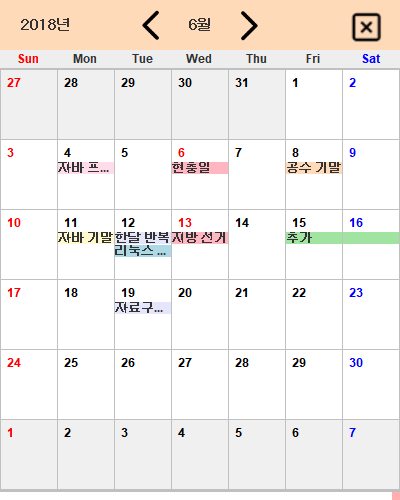
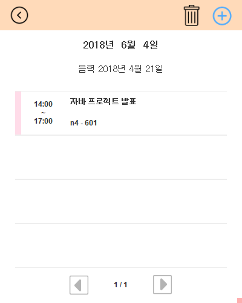
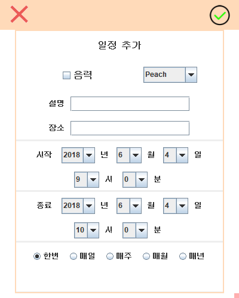
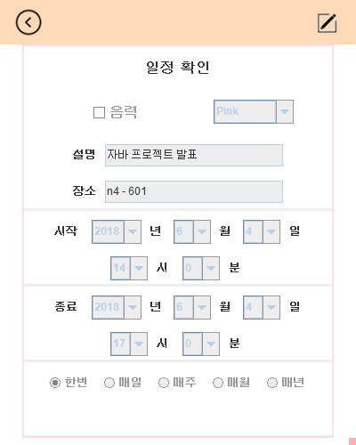
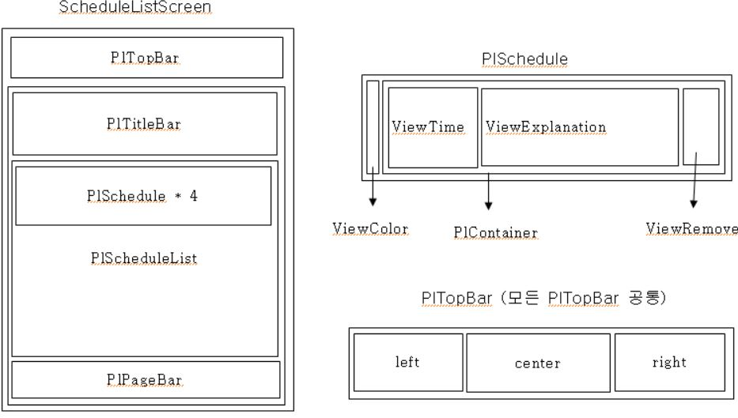
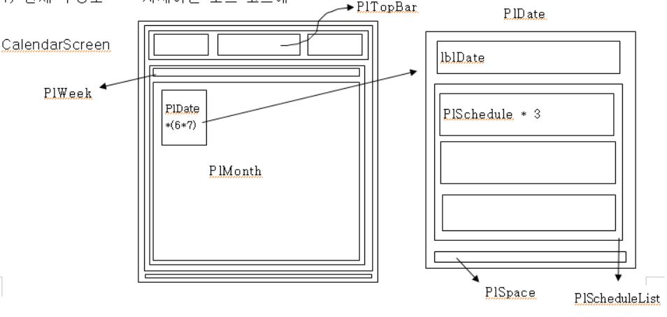

# Sticky-Calendar
 
프로젝트 소개
----------------
sticky notes + Calender
java의 swing을 활용해 GUI환경의 캘린더 제작

기능
- 캘린더 기능
- 일정 추가 / 수정 / 삭제
- 일정에는 날짜, 시간, 설명, 장소, 반복, 카테고리를 설정할 수 있다.
- 캘린더에는 각 일정들이 카테고리로 설정된 색에 따라 라벨 형태로 표시된다.

사용자는 캘린더를 화면 가장자리에 띄울 수 있고, 상단 바를 드래그하여 창의 위치를 바꿀 수 있다.

스크린샷
---------------

캘린더 화면. 공휴일과 일정 등이 라벨의 형태로 표시된다.
sticky notes 위의 주황색 바를 드래그하여 윈도우 상에서 표시될 위치를 옮길 수 있다.

일정 리스트화면
캘린더에서 어느 날짜를 클릭하면 해당 날짜의 일정들이 리스트로 자세하게 표시된다.
상단의 쓰레기통 버튼으로 일정을 삭제하거나, + 버튼으로 일정을 추가할 수 있다.
리스트의 일정을 클릭하면 해당 일정을 수정할 수 있다.

일정 추가화면
일정을 추가하면 해당 일정에 대한 설명과 장소, 시간과 반복 설정을 할 수 있다.
음력 설정과 색상을 통해 카테고리를 설정할 수 있다.
상단의 X 버튼으로 취소하거나 체크버튼으로 저장한다.

일정 확인화면
일정을 저장하거나 일정 리스트에서 일정을 선택하면 해당 일정에 대한 정보들이 자세하게 나온다.
우측 상단의 버튼을 통해 일정 정보를 수정할 수 있다. 일정 수정은 일정 추가와 비슷한 방식으로 가능하다.

개발동기 등
-----------------
java를 배우고 이를 활용한 GUI 환경 프로젝트로 아이디어를 구상하던 중, windows 10의 sticky notes를 유용하게 사용했던 경험을 떠올려 이와 캘린더를 결합하는 아이디어로 프로젝트를 진행하기로 하였다.
따라서 sticky notes의 디자인, 기능과 스마트폰에 기본적으로 깔려있는 캘린더 앱의 디자인을 결합한 앱을 목표로 개발을 진행하였다.

- 개발 기간은 약 2주
- 데이터베이스를 몰라 직접 구현하여 사용...
- java swing과 Window Builder 활용
- 디자인에 많이 집중한 프로젝트

Sticky notes 에서 프로젝트 이름을 따와 StickyCalendar라고 이름지었다.

만들고 싶은 기능들을 대부분 구현하여 만족했지만, 나중에 코드를 다시 살펴보니 가독성이 좋지 않아 수정하기는 어려웠다.
그래서 이후 프로젝트부터는 가독성을 올리고 깔끔하게 구현하는 것을 목표로 개발을 진행하게 되었다.

사용한 기술과 이것저것
--------------------
swing을 이용해 GUI 환경을 구성했다. 
대부분의 구성요소들은 JPanel 클래스를 상속받아 기능과 속성을 재정의하여 사용하였다.

UI에 신경을 많이 썼는데, 구상하던 레이아웃을 그대로 구현하기 위해 노트에 와이어프레임을 그리며 진행하였다.

이런 식으로 모든 객체를 설계하고, 고쳐가며 화면을 구성했다.

데이터베이스를 모르던 시절이라 데이터를 로딩하여 화면을 구성할때 각 날짜 객체가 자신에게 표시되어야 할 정보를 불러오는 과정을 만드는 부분이 힘들었다. 
이를 구현하기 위해 날짜에 대한 정보들은 날짜 정보 객체와 날짜 그래픽 객체로 분리하고 로딩 과정을 설계했다. 
일정 정보를 로딩할 때에 이 일정이 들어가야할 날짜 정보 객체를 선택하여 자신의 정보를 저장해놓고, 날짜 그래픽 객체가 화면에 표시되어야 할때에 자신과 맞는 정보 객체를 불러와 적용하는 방식으로 구현했다.

캘린더에서 일정을 라벨 형식으로 나타내는데, 이 라벨의 순서를 결정하는 것에서 많은 고민을 했다. 
위의 레이아웃 그림에서 날짜는 PlDate, 일정은 PlSchedule 객체를 이용해 표현하는데, 2일 이상의 긴 일정을 라벨 형식으로 표현하기 위해서는 이 일정이 있는 모든 날짜 객체가 같은 순서로 라벨을 배치해야 하기 때문이다.
이때 긴 일정과 짧은 일정이 여럿 겹쳐있으면 순서가 꼬이거나 공간이 남아있음에도 표시가 안되는 경우가 발생했다. 
또한 대부분의 일정이 위쪽으로 배치되는데 긴 일정 하나가 아래쪽으로 배치되어 일관성을 해치는 경우가 발생했다.

이 문제는 우선순위 큐를 활용하여 보완했다. 
- 먼저 일정 객체를 우선순위 큐에서 비교될 수 있는 객체로 만들고 일정 자체가 배치 순서 값을 가지며, 객체 생성시에 -1로 초기화한다. 
- 이후 날짜를 로딩할때 앞에서부터 로딩하여 해당 날짜에서 배치해야 하는 일정 객체에 배치 순서가 -1이면 우선순위 큐를 이용해 해당 일정의 배치 순서를 결정한다.
- 배치 순서의 결정은 해당 일정이 지속되는 날짜를 기준으로 결정했으며, 이를 통해 긴 일정이 앞 순서에 배치되도록 유도하여 두가지 문제를 모두 해결하였다.
- 배치 순서는 한번 결정되면 그 자리는 다른 일정이 차지할 수 없다.

문제점
------------
레이아웃 매니저를 잘 활용하지 못해 화면을 배치하기 위해 너무 많은 객체를 생성하기에 속도가 느리다는 문제점이 있다.
- 속도가 느리다는 점이 드러나지 않게하기 위해 현재 표시되는 달의 양옆 달력을 미리 생성하여 교체하고, 이후 객체를 재활용하는 방식으로 보완하였다.
- 따라서 달력 객체는 3개만 생성하도록 구현하여 보완하였다.
이상하게 설날 연휴와 관련된 일정만이 제대로 작동하지 않는다...
